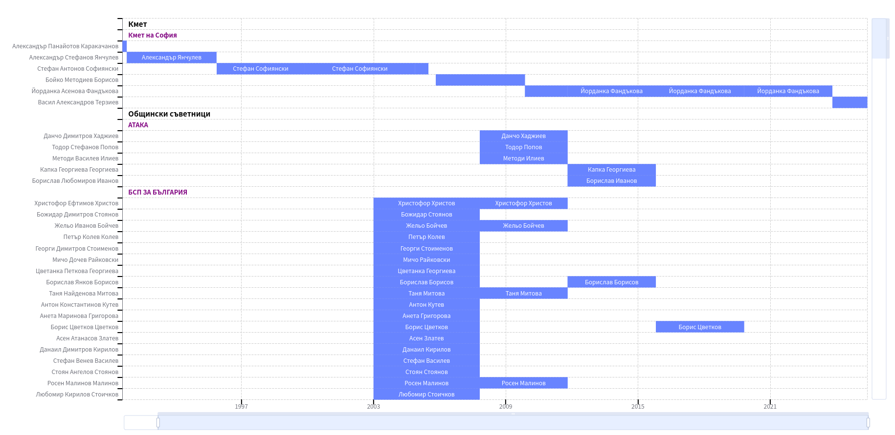

# Просто София

[Демо](https://ibbk-rnd.github.io/just-sofia)



## Софтуер

В проекта са използвани следните технологии и библотеки:

- [Angular](https://angular.dev/installation)
- [Bootstrap](https://getbootstrap.com/)
- [Apache ECharts](https://echarts.apache.org/examples/en/index.html)

## Стартиране

Стартирането на този проект е изключително лесно, като стандартна Angular апликация.

Инсталирайте библотеките

```bash
npm install
```

Стартирайте локалния сървер

```bash
npm start
```

За подброни инструкции следвайте [официалната документация](https://angular.dev/installation) на Angular.

## Данни

За данните използвани в проекта прочетете [тук](public/data/README.md)

## Допринасяне

Ако желаете да допринесете за подобряването на данните, кода, отстраняването на бъгове или подобряването на документацията, моля, направете pull request.  
